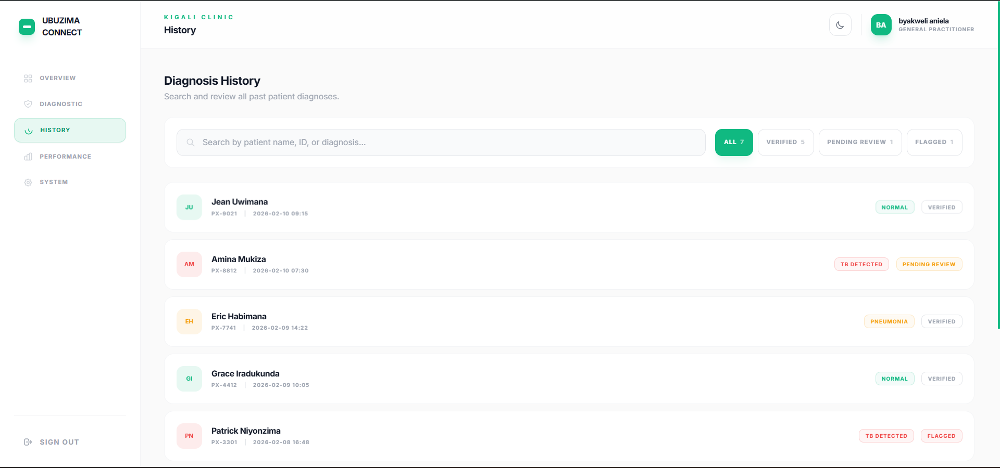
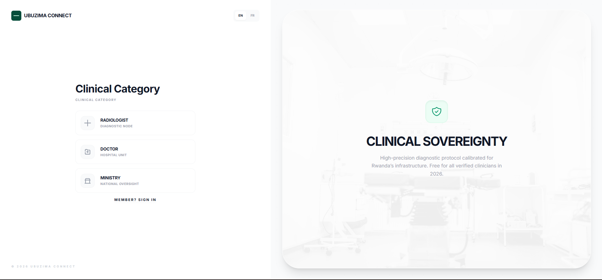
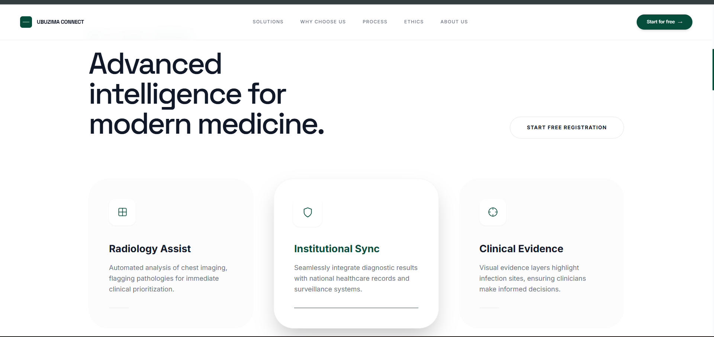
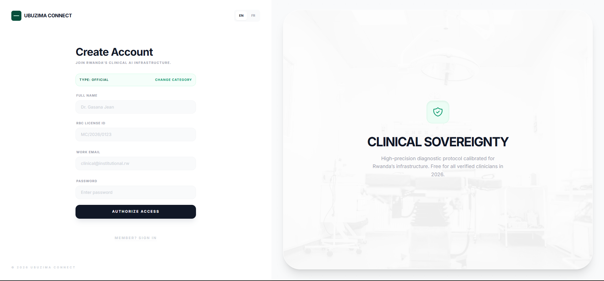
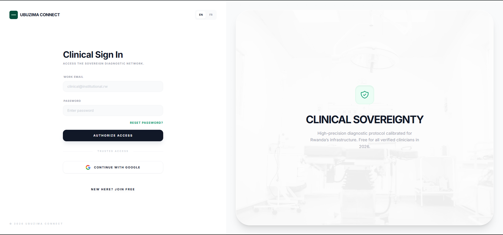

# Ubuzima Connect

AI-powered clinical diagnostic platform for chest X-ray analysis, designed to detect Tuberculosis (TB) and Pneumonia using locally calibrated deep learning models for Rwandan healthcare facilities.

---

## Table of Contents

- [Description](#description)
- [Features](#features)
- [Tech Stack](#tech-stack)
- [Project Structure](#project-structure)
- [Environment Setup](#environment-setup)
- [Application Flow](#application-flow)
- [Screenshots](#screenshots)
- [System Design (UML Diagrams)](#system-design-uml-diagrams)
- [ML Model Summary](#ml-model-summary)
- [Deployment](#deployment)
- [Video Demo](#video-demo)
- [Author](#author)
- [License](#license)

---

## Description

Ubuzima Connect is a web-based diagnostic tool that enables radiologists and clinicians to upload chest X-ray images and receive AI-assisted predictions for Tuberculosis and Pneumonia. The system uses a pre-trained CNN model fine-tuned on locally sourced clinical data from East African healthcare facilities.

The platform provides:
- Real-time AI-powered chest X-ray diagnosis
- Patient diagnosis history with search and filtering
- Model performance evaluation metrics
- Role-based authentication for healthcare professionals
- Light and dark mode interface

---

## Features

- **Intro Animation** -- Cinematic loading sequence with GSAP animations
- **Landing Page** -- Hero section with product overview, features, pricing, FAQ, and CTA
- **Authentication** -- Firebase Auth with email/password and Google OAuth, role selection (Radiologist, GP, Specialist)
- **Radiologist Dashboard**
  - Overview -- Quick stats, recent scans, and getting started guide
  - Diagnostic Station -- Upload chest X-ray, AI analysis with confidence score and clinical observation
  - History -- Searchable patient diagnosis records with status filtering (Verified, Pending Review, Flagged)
  - Performance -- Model evaluation metrics (accuracy, F1, precision, recall, confusion matrix)
  - Settings -- Profile management, active model info, sign out

---

## Tech Stack

| Layer            | Technology                                       |
|------------------|--------------------------------------------------|
| Frontend         | React 19, TypeScript, Vite                       |
| Styling          | Tailwind CSS                                     |
| Animation        | GSAP                                             |
| Authentication   | Firebase Auth (Email/Password + Google OAuth)     |
| Database         | Firebase Firestore                               |
| ML Model         | CNN (pre-trained on NIH 112k, fine-tuned on VinDr 18k+) |
| Deployment       | Vercel                                           |

---

## Project Structure

```
ubuzima-connect/
├── components/
│   ├── AuthPage.tsx            # Login, registration, forgot password
│   ├── CTA.tsx                 # Call to action section
│   ├── Dashboard.tsx           # Radiologist dashboard (all tabs)
│   ├── FAQ.tsx                 # Frequently asked questions
│   ├── Features.tsx            # Features showcase section
│   ├── Footer.tsx              # Footer component
│   ├── Hero.tsx                # Hero landing section
│   ├── IntroSequence.tsx       # Animated intro sequence
│   ├── Navbar.tsx              # Navigation bar
│   ├── Pricing.tsx             # Pricing plans section
│   ├── Process.tsx             # How it works section
│   ├── Services.tsx            # Services section
│   └── firebaseConfig.ts      # Firebase configuration
├── screenshoots/
│   ├── screenshoots/           # Application screenshots
│   └── uml diagrams/          # UML design diagrams
│       ├── use_case1_diagram.png
│       ├── use_case2_diagram.png
│       ├── class_diagram.png
│       ├── Sequence_login_flow.png
│       ├── Sequence_diagnosis_flow.png
│       └── activity_diagram.png
├── App.tsx                     # Root application component
├── firebaseconfig.ts           # Firebase initialization
├── index.tsx                   # Application entry point
├── index.html                  # HTML template
├── metadata.json               # Project metadata
├── package.json                # Dependencies and scripts
├── tsconfig.json               # TypeScript configuration
├── vite.config.ts              # Vite build configuration
└── README.md
```

---

## Environment Setup

### Prerequisites

- Node.js 18+
- npm (package manager)
- Firebase project with Authentication and Firestore enabled

### Installation

1. **Clone the repository**

```bash
git clone https://github.com/[your-username]/ubuzima-connect.git
cd ubuzima-connect
```

2. **Install dependencies**

```bash
npm install
```

3. **Configure Firebase**

Open `firebaseconfig.ts` and ensure your Firebase project credentials are set:

```typescript
const firebaseConfig = {
  apiKey: "your_api_key",
  authDomain: "your_project.firebaseapp.com",
  projectId: "your_project_id",
  storageBucket: "your_project.firebasestorage.app",
  messagingSenderId: "your_sender_id",
  appId: "your_app_id"
};
```

4. **Enable Firebase services**

In the Firebase Console:
- Go to Authentication > Sign-in method > Enable Email/Password and Google
- Go to Firestore Database > Create database in production mode

5. **Run the development server**

```bash
npm run dev
```

6. **Open the application**

Navigate to `http://localhost:5173` in your browser.

---

## Application Flow

```
App Loads
  |
  v
Intro Animation Sequence (GSAP)
  |
  v
Hero Landing Page
  |-- Features, Services, Process, Pricing, FAQ, CTA sections
  |
  v
User clicks "Get Started"
  |
  v
Authentication Page
  |-- Login (email/password or Google)
  |-- Register (role selection: Radiologist / GP / Specialist)
  |-- Forgot Password
  |
  v
Radiologist Dashboard
  |-- Overview Tab: Stats, recent scans, quick actions
  |-- Diagnostic Tab: Upload X-ray -> AI analysis -> Result
  |-- History Tab: Search/filter past diagnoses
  |-- Performance Tab: Model metrics and confusion matrix
  |-- Settings Tab: Profile, model info, sign out
```

---

## Screenshots

### Intro Sequence


### Hero Landing Page


### Authentication Page


### Dashboard Overview


### Diagnostic Station


### History Tab


### Performance Metrics


### Dark Mode


> **Note:** Update the screenshot filenames above to match the correct screen after reviewing each image. The current filenames are the raw UUIDs from Windows screenshot tool -- you may want to rename them for clarity (e.g., `intro.png`, `hero.png`, `auth.png`, etc.).

---

## System Design (UML Diagrams)

### Use Case Diagram


The use case diagram shows two actors: **Radiologist** (primary user) and **Admin** (future). The radiologist can register, login, upload X-rays, view AI results, search patient history, view model performance, and manage their profile. The admin (to be built later) will handle model retraining and user management.

### Class Diagram


The class diagram defines three core entities: **User** (authentication and profile data stored in Firestore), **DiagnosisRecord** (patient diagnosis data including result, confidence, observation, and review status), and **MLModel** (model metadata and evaluation metrics). Relationships show that one User performs many DiagnosisRecords, and one MLModel generates many AnalysisResults.

### Sequence Diagram -- Login Flow


This sequence diagram traces the login process: the user enters credentials on the Auth page, Firebase Auth validates them, the user profile is fetched from Firestore, and the dashboard loads with the user's data. Error handling shows how invalid credentials are communicated back to the user.

### Sequence Diagram -- Diagnosis Flow


This sequence diagram shows the diagnostic workflow: the radiologist uploads a chest X-ray, the image is sent to the ML model API for inference, the prediction (Normal/TB/Pneumonia) with confidence score is returned and displayed, and the diagnosis record is saved to the patient history.

### Activity Diagram


The activity diagram maps the complete user journey from app load through the intro animation, hero page, authentication (login or register), and into the dashboard where the user can navigate between diagnostic, history, performance, and settings tabs before signing out.

---

## ML Model Summary

| Property            | Detail                                              |
|---------------------|-----------------------------------------------------|
| Architecture        | CNN with Transfer Learning                          |
| Pre-training Data   | NIH Chest X-ray Dataset (112,120 images)            |
| Fine-tuning Data    | VinDr-CXR Dataset (18,000+ images)                 |
| Validation Data     | Shenzhen Hospital TB Dataset                        |
| Input Size          | 224 x 224 pixels (grayscale chest X-ray)            |
| Output Classes      | Normal, Tuberculosis (TB), Pneumonia                |
| Accuracy            | 94.2%                                               |
| F1-Score            | 0.91                                                |
| Precision           | 93.8%                                               |
| Recall              | 92.1%                                               |

### Data Pipeline

```
Raw X-ray Images
  |
  v
Preprocessing (Resize 224x224, Normalize, Augmentation)
  |
  v
Train/Validation/Test Split (70/15/15)
  |
  v
Pre-trained CNN Base (NIH 112k images)
  |
  v
Fine-tune on Local Data (VinDr 18k+ images)
  |
  v
Evaluate (Accuracy, F1, Precision, Recall, Confusion Matrix)
  |
  v
Deploy as API Endpoint
  |
  v
Frontend Sends X-ray -> API Returns Prediction
```

---

## Deployment

| Service          | Platform     | Purpose                          |
|------------------|--------------|----------------------------------|
| Frontend         | Vercel       | React app hosting with CI/CD     |
| Authentication   | Firebase     | User auth and session management |
| Database         | Firestore    | User profiles and diagnosis data |
| ML Model API     | TBD          | Model inference endpoint         |

### Deploy to Vercel

1. Push your code to GitHub
2. Go to [vercel.com](https://vercel.com) and import the repository
3. Vercel will auto-detect the Vite configuration
4. Click Deploy

---

## Video Demo

[Link to video demo]


